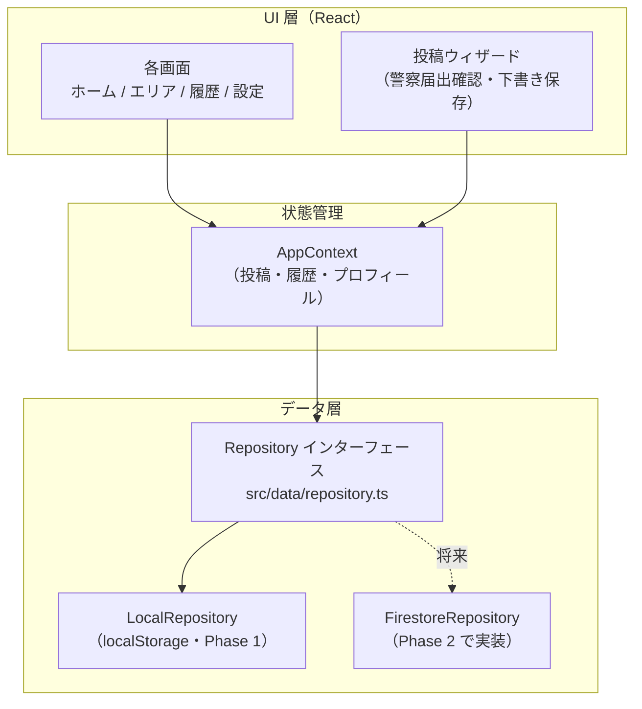

# みまもりネット

障害のある方などが行方不明になった際、SNSへの無制限拡散ではなく、**対象エリア内の登録メンバーだけ**に必要な情報を必要なときだけ届ける、セミクローズドな見守りアプリです。

- 公開URL: https://knowinc-hub.github.io/mimamori-net/
- 対象エリア: 練馬区・西東京市・武蔵野市（特別支援学校の学区に対応）
- 全体計画: [docs/PRODUCTION_PLAN.md](docs/PRODUCTION_PLAN.md)
- Phase 1 完了レポート: [docs/PHASE1_REPORT.md](docs/PHASE1_REPORT.md)

## 絶対に守る設計原則（変更禁止）

1. **SNS共有機能は実装しない**（シェアボタン・OGP最適化・拡散導線を作らない）
2. **解決したら消える**（解決時に写真・氏名・特徴・連絡先を削除。履歴は日時・エリアのみ）
3. **エリア内の登録メンバーのみ閲覧可能**
4. **登録は承認制**
5. **警察への届出が前提**（アプリは警察捜索の「補完」）

詳細は [docs/PRODUCTION_PLAN.md](docs/PRODUCTION_PLAN.md) の第2章を参照。

## 技術スタック（Phase 1 時点）

- Vite + React 19 + TypeScript
- Tailwind CSS 4
- PWA（vite-plugin-pwa / Workbox）
- アイコン: lucide-react
- データ層: localStorage ベースのモック実装（Phase 2 で Firebase / Firestore に差し替え予定）

## アーキテクチャ



**重要**: UI から localStorage を直接触らないこと。データアクセスは必ず `Repository` インターフェース（[src/data/repository.ts](src/data/repository.ts)）経由にする。Phase 2 では `localRepository.ts` を Firestore 実装に差し替えるだけで移行できる構成になっています。

## 開発

```bash
npm install
npm run dev        # 開発サーバ
npm run build      # 型チェック + 本番ビルド（dist/）
npm run preview    # ビルド結果の確認
node scripts/generate-icons.mjs  # PWAアイコンの再生成
```

## デプロイ

`main` ブランチへのマージで GitHub Actions（[.github/workflows/deploy.yml](.github/workflows/deploy.yml)）が GitHub Pages へ自動デプロイします。作業は `dev` ブランチで行い、Phase ごとに PR を作成します。

※ リポジトリの Settings → Pages で「Source: GitHub Actions」に切り替えが必要です（初回のみ）。

## 転載抑止の限界について（重要）

依頼写真には「みまもりネット限定共有」の透かしを重ね、長押し保存・ドラッグ保存をしにくくしていますが、**スクリーンショット等による転載を完全に防ぐことは技術的に不可能です**。この機能を過信せず、承認制メンバーシップと利用規約（Phase 4 で整備）を含めた運用全体で転載リスクを下げる方針です。

## Phase 2 に向けたメモ

- バックエンドは Firebase（Auth / Firestore / Cloud Functions / FCM / Storage）を採用予定
- **Scheduled Functions（自動削除の日次バッチ）には Blaze プラン（従量課金）が必要**。有効化の際は Google Cloud コンソールの「予算とアラート」で月1,000円の予算アラートを必ず設定すること（手順は Phase 2 の README 更新で詳述する）
- セキュリティルールのユニットテスト（@firebase/rules-unit-testing）を最優先で整備する
